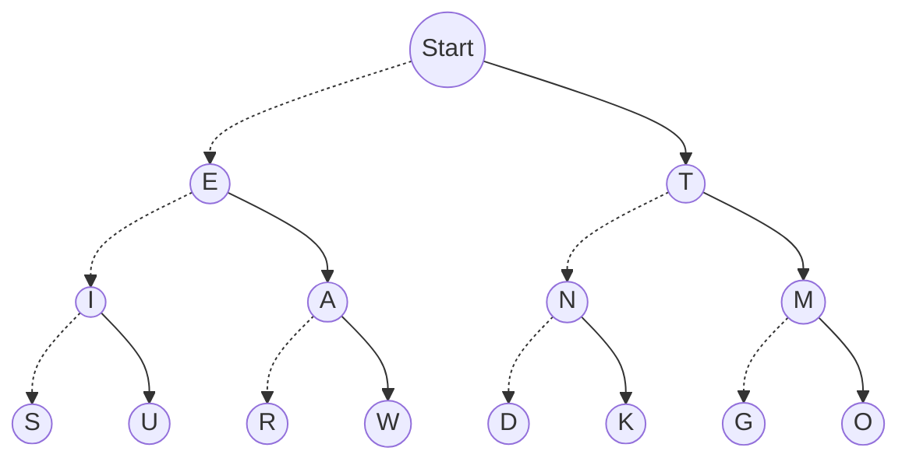

## Problem: 
#### This code is inspired on Morse code using  the dot ( . ) and dasth ( - ). 
**Example:**  
. is E
\- is T
..- is  U
-.- is K

but here is if you find ? simbol
? is [ E , T ]
.? is [ I , A ]
-?- is [ K , O ]

and 

?? is [ I , A , N , M ]
?.? is [S , U , D , K ] 


###  SOLUTION:
I require a node 
```kotlin
class TreeNode<T>(val value: T) {
    val children: MutableList<TreeNode<T>> = mutableListOf()
}
```
then I added extension function to the class TreeNode where you can get the left child and the right child
```kotlin
fun <T> TreeNode<T>.getChildLeft(): TreeNode<T> = children[0]

fun <T> TreeNode<T>.getChildRight(): TreeNode<T> = children[1]
```
and then I initialized the TreeNode as the flow chart indicates
```kotlin
fun makeWord(): TreeNode<String> {
	val _init = TreeNode("")
	 ...
	 return _init
}
```
### Solution code
```kotlin
fun main(args: Array<String>) {
    val tree = makeWord()
    val splitted = a[0].split("")
    var resultLocal: ArrayList<TreeNode<String>> = arrayListOf(tree)

    var nodeArray = arrayListOf<TreeNode<String>>()
    splitted.forEach {
        if (it != "") {
            nodeArray = when (it) {
                "." -> {
                    if (nodeArray.size == 0)
                        arrayListOf(tree.getChildLeft())
                    else if (nodeArray.size == 1)
                        arrayListOf(nodeArray[0].getChildLeft())
                    else {
                        val local = arrayListOf<TreeNode<String>>()
                        for (index in 0 until nodeArray.size) {
                            local.add(nodeArray[index].getChildLeft())
                        }
                        local
                    }
                }
                "-" -> {
                    if (nodeArray.size == 0)
                        arrayListOf(tree.getChildRight())
                    else if (nodeArray.size == 1)
                        arrayListOf(nodeArray[0].getChildRight())
                    else {
                        val local = arrayListOf<TreeNode<String>>()
                        for (index in 0 until nodeArray.size) {
                            local.add(nodeArray[index].getChildRight())
                        }
                        local
                    }

                }
                "?" -> {
                    if (nodeArray.size == 0)
                        arrayListOf(tree.getChildLeft(), tree.getChildRight())
                    else {
                        val local = arrayListOf<TreeNode<String>>()
                        for (index in 0 until nodeArray.size) {
                            local.add(nodeArray[index].getChildLeft())
                            local.add(nodeArray[index].getChildRight())
                        }
                        local
                    }
                }
                else -> {
                    arrayListOf()
                }
            }
            resultLocal = nodeArray
        }
    }
    var arrayList = arrayListOf<String>()
    resultLocal.forEach {
        arrayList.add(it.value)
    }
    println(arrayList)
}

class TreeNode<T>(val value: T) {
    val children: MutableList<TreeNode<T>> = mutableListOf()
}

fun <T> TreeNode<T>.getChildLeft(): TreeNode<T> = children[0]

fun <T> TreeNode<T>.getChildRight(): TreeNode<T> = children[1]

fun <T> TreeNode<T>.getChild(value: T): TreeNode<T> {
    return children.first {
        it.value == value
    }
}
fun <T> TreeNode<T>.add(child: TreeNode<T>): Boolean {
    return children.add(child)
}

fun makeWord(): TreeNode<String> {
    val _init = TreeNode("")
    val a = TreeNode("A")
    val b = TreeNode("B")
    val c = TreeNode("C")
    val d = TreeNode("D")
    val e = TreeNode("E")
    val f = TreeNode("F")
    val g = TreeNode("G")
    val h = TreeNode("h")
    val i = TreeNode("I")
    val j = TreeNode("J")
    val k = TreeNode("k")
    val l = TreeNode("L")
    val m = TreeNode("M")
    val n = TreeNode("N")
    val o = TreeNode("O")
    val p = TreeNode("P")
    val q = TreeNode("Q")
    val r = TreeNode("R")
    val s = TreeNode("S")
    val t = TreeNode("T")
    val u = TreeNode("U")
    val v = TreeNode("V")
    val w = TreeNode("W")
    val x = TreeNode("X")
    val y = TreeNode("Y")
    val z = TreeNode("Z")
    _init.add(e)
    _init.add(t)
    e.add(i)
    e.add(a)
    i.add(s)
    i.add(u)
    a.add(r)
    a.add(w)

    t.add(n)
    t.add(m)
    n.add(d)
    n.add(k)
    m.add(g)
    m.add(o)
    return _init
}
